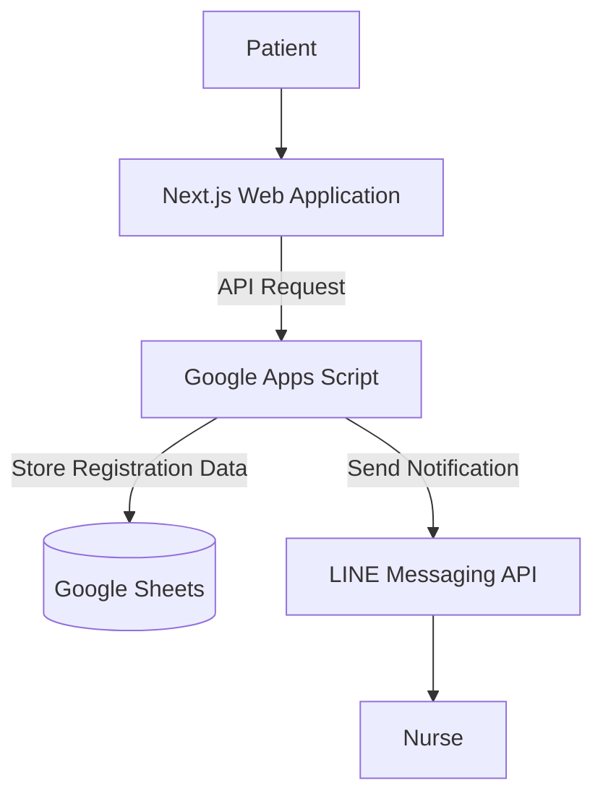

## Overview

A Telemedicine Registration System that reduced patient registration steps by 80% from 5 to 1. Built with Next.js, Google Apps Script, and Google Sheets, with nurse notifications via the LINE Messaging API and CI/CD implemented using free-tier cloud services.

## System Architecture

## Tech Stack

* **Frontend:** Next.js, Tailwind CSS
* **Backend:** Google Apps Script
* **Data Storage:** Google Sheets
* **Messaging Integration:** LINE Messaging API

## Publication

The project was featured on the Kamphaeng Phet Municipality website.

