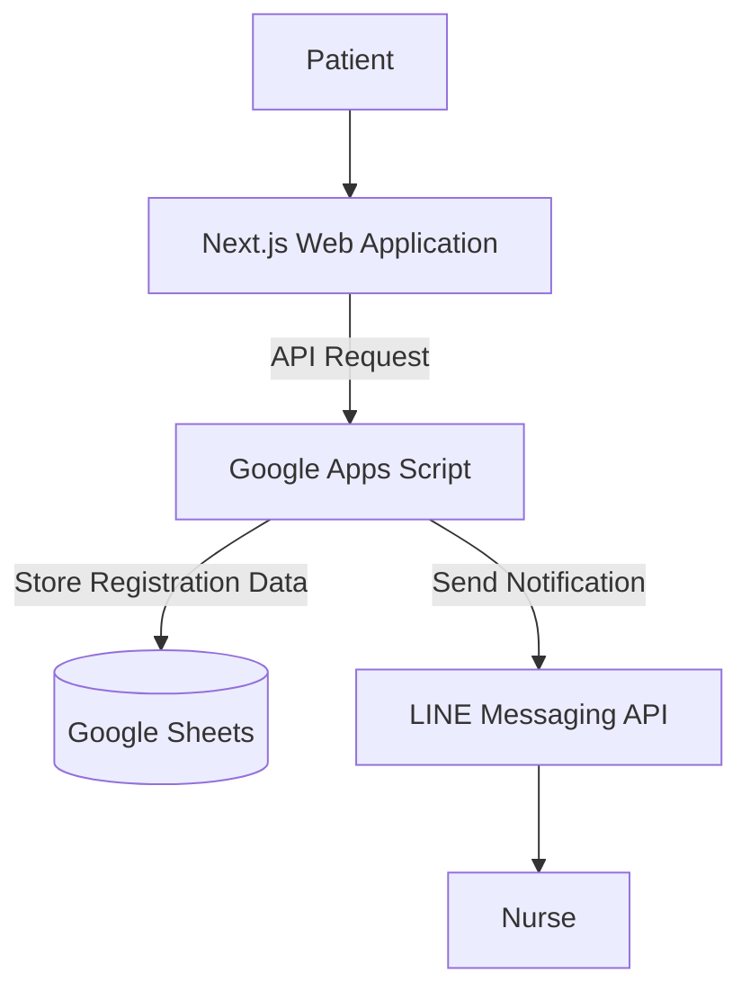

## Overview

Reduced registration-related calls by 80% allowing 4 out of 5 patients to register without calling hospital staff. Built the system with Next.js, Google Apps Script and Google Sheets. Implemented nurse notifications via the LINE Messaging API and CI/CD using free-tier cloud services.

## System Architecture

## Notification Preview

Registration notifications are sent to nurses via the LINE Messaging API using Flex Messages.

## Tech Stack

* **Frontend:** Next.js, Tailwind CSS
* **Backend:** Google Apps Script
* **Data Storage:** Google Sheets
* **Messaging Integration:** LINE Messaging API

## Publication

The project was adopted by the Mayor of Kamphaeng Phet Municipality.

