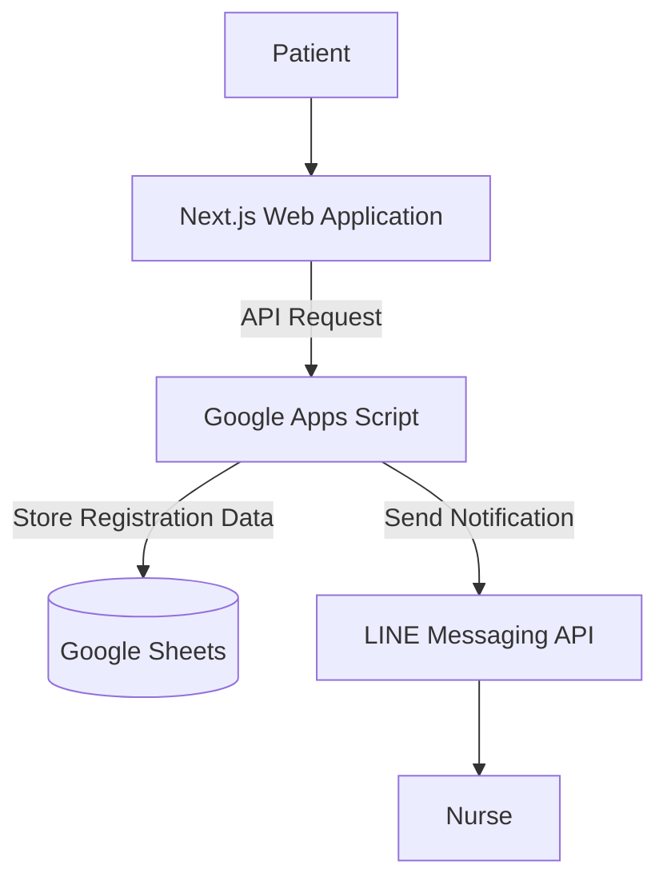

## Overview

A Telemedicine Registration System that allows patients to register for remote healthcare services through a web application. The system stores registration data in Google Sheets and notifies nurses through the LINE Messaging API.

## System Architecture

## Tech Stack

* **Frontend:** Next.js, Tailwind CSS
* **Backend:** Google Apps Script
* **Data Storage:** Google Sheets
* **Messaging Integration:** LINE Messaging API

## Publication

The project was featured on the Kamphaeng Phet Municipality website.

[View the publication on the Kamphaeng Phet Municipality website](https://www.kppmu.go.th/news-detail?hd=1&id=124000)
