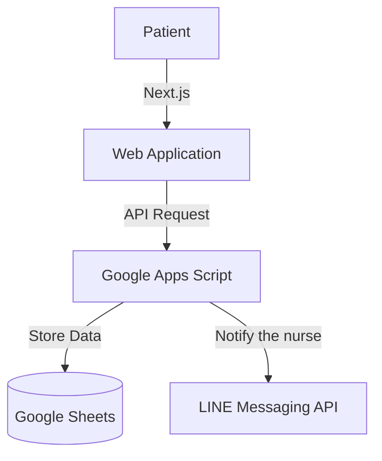

## Flowchart

## Tech

- **Frontend:** Next.js, Tailwind CSS
- **Backend:** Google Apps Script, Google Sheets
- **API:** LINE Messaging API

## Publications

- [Official News](https://www.kppmu.go.th/news-detail?hd=1&id=124000)
- [Newspaper](https://fa8.naxapi.com/kppmu.go.th/dnm_file/project/1751867708230_50070_center.pdf#page=3)

