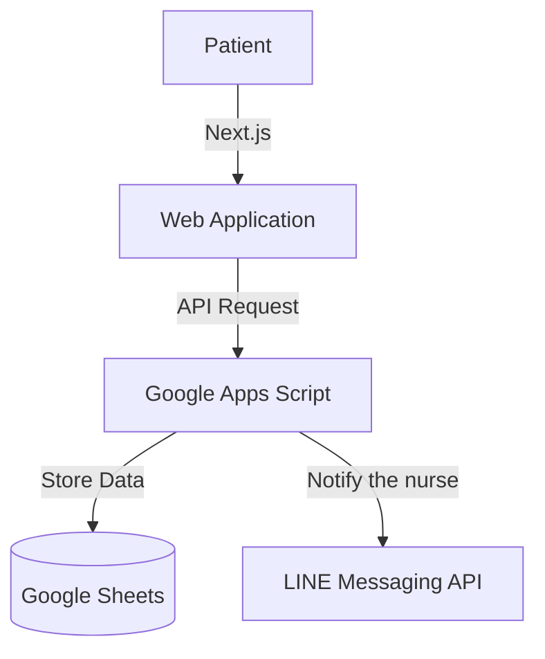

## Flowchart

```mermaid
graph TD
    A[Patient] -->|Next.js| B[Web Application]
    B -->|API Request| C[Google Apps Script]
    C -->|Store Data| D[(Google Sheets)]
    C -->|Notify the nurse| E[LINE Messaging API]
```

## Tech

- **Frontend:** Next.js, Tailwind CSS
- **Backend:** Google Apps Script
- **Database:** Google Sheets
- **API:** LINE Messaging API

## Publications

